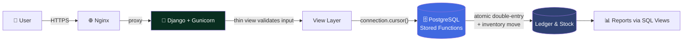
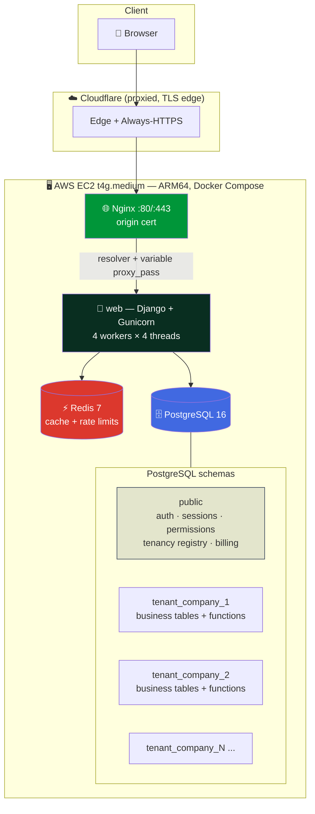
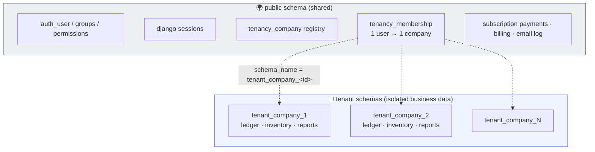
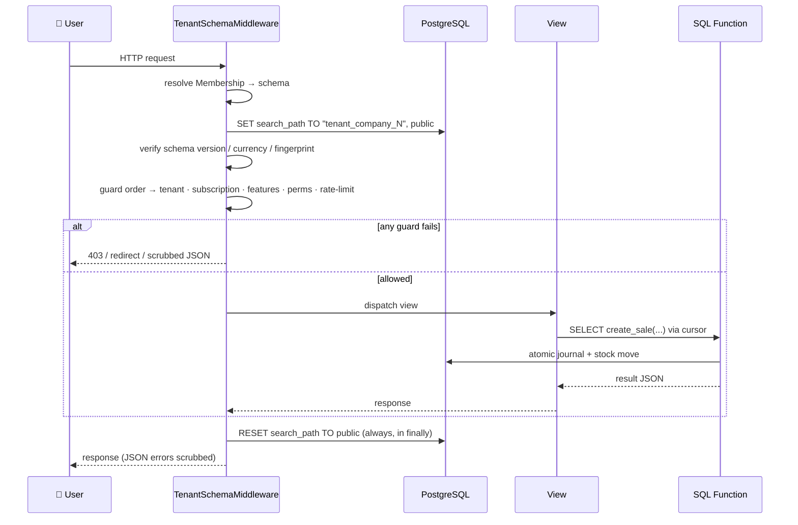
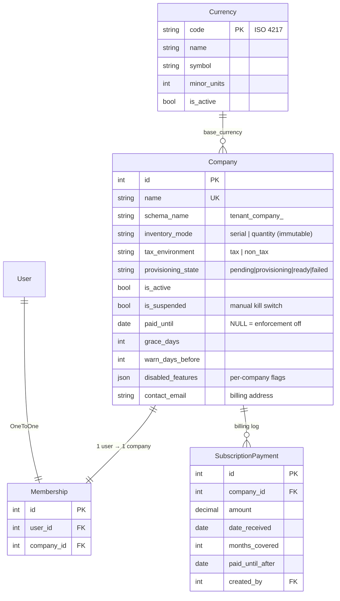
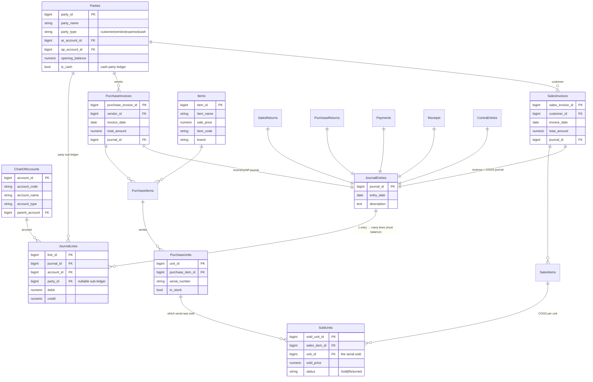
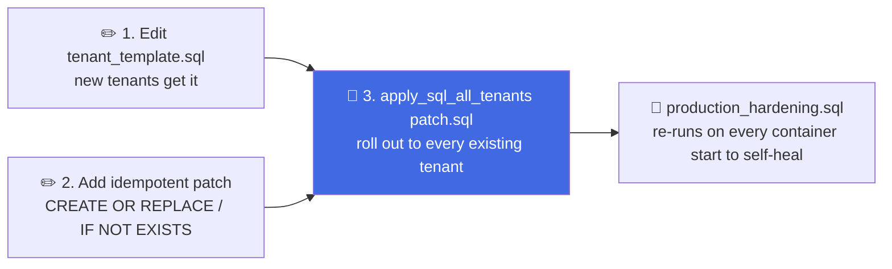
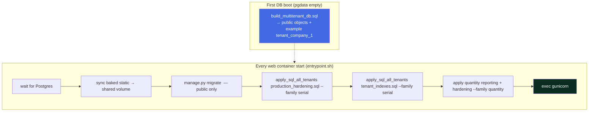
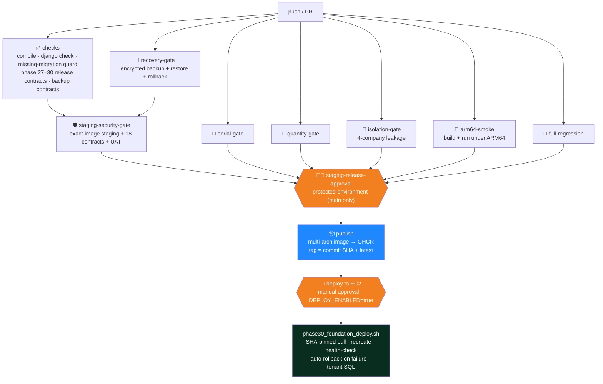

<div align="center">

# 💠 Financee

### Multi-Tenant Accounting & Inventory Platform for Small and Medium Businesses

*One installation. Many isolated companies. Bulletproof double-entry accounting — powered entirely by PostgreSQL.*

<br/>


-0091BD?style=for-the-badge&logo=arm&logoColor=white)


</div>

---

## 📑 Table of Contents

1. [What is Financee?](#-what-is-financee)
2. [Why we built it](#-why-we-built-it)
3. [How it helps businesses](#-how-it-helps-businesses)
4. [How it works — the core idea](#-how-it-works--the-core-idea)
5. [Tech stack](#-tech-stack)
6. [System architecture](#-system-architecture)
7. [Multi-tenancy model](#-multi-tenancy-model)
8. [Request lifecycle](#-request-lifecycle)
9. [Database design & ER diagrams](#-database-design--er-diagrams)
10. [Backend deep-dive](#-backend-deep-dive)
11. [Frontend](#-frontend)
12. [The two schema families (serial & quantity)](#-the-two-schema-families)
13. [Deployment](#-deployment)
14. [CI/CD pipeline](#-cicd-pipeline)
15. [Backups & disaster recovery](#-backups--disaster-recovery)
16. [Testing](#-testing)
17. [Local development](#-local-development)
18. [Project layout](#-project-layout)
19. [Documentation map](#-documentation-map)

---

## 🎯 What is Financee?

**Financee** is a production accounting and inventory system that serves **many separate companies from a single deployment**. Every company gets its own fully isolated database schema, its own users, its own ledgers, inventory, and reports — while the operator runs and bills them all from one admin panel.

It is built for the way real small businesses actually work: **buy stock → sell it → handle returns → collect and pay money → close the month → read the reports** — with correct double-entry bookkeeping enforced at every single step, not as an afterthought.

> **The defining architectural choice:** Django handles *only* HTTP. **All business logic — accounting, inventory, FIFO costing, returns, ledgers, reports — lives inside PostgreSQL** as stored functions, triggers, and views. This makes the financial core auditable, atomic, and impossible to bypass from application code.

---

## 💡 Why we built it

Most off-the-shelf accounting tools force a business into one of two bad corners:

| Problem with typical tools | How Financee answers it |
| --- | --- |
| 🧩 **SaaS lock-in & per-seat pricing** that punishes growth | Self-hosted, **per-company flat billing**, operator-controlled |
| 🔓 **Shared databases** where a query bug can leak Company A's data into Company B | **Hard schema isolation** — each company is a separate PostgreSQL schema |
| 🐛 **Business logic scattered in application code** where a developer can post an unbalanced journal | Accounting lives in the **database** with balance-enforcing triggers |
| 📦 **Inventory & accounting bolted together loosely**, drifting out of sync | Every stock movement and every rupee move through the **same atomic SQL transaction** |
| 🌍 **One-size-fits-all** — can't handle both serialized goods (phones/IMEI) and bulk goods (kilos/boxes) | **Two schema families**: serial-tracked *and* quantity/FIFO, chosen per company |

Financee exists to give a small operator a **trustworthy, isolated, low-cost** accounting backbone they can host once and resell to many clients with confidence.

---

## 🏢 How it helps businesses

For the **business owner** using Financee:

- 🧾 **Correct books, automatically.** Every purchase, sale, return, payment, receipt, and contra entry posts a **balanced double-entry journal**. The trial balance always balances — the database refuses to let it not.
- 📦 **Inventory that matches the money.** Stock and cost of goods sold are updated in the *same* transaction as the sale, so inventory value on the balance sheet is always real.
- 🔁 **Returns done right.** Sale/purchase returns restore the exact original cost basis; serials can't be double-returned; a sold serial can't be un-purchased.
- 📊 **Reports that mean something.** Ledgers, trial balance, receivables/payables, cash ledger, stock & serial reports, monthly reports, and sales analytics — all computed from the same authoritative ledger.
- 📎 **Document trail.** Attach the scanned invoice (image + PDF) to any sale, purchase, return, payment, receipt, or contra.
- 🌐 **Multi-currency & tax ready** (quantity companies): foreign invoices, realized exchange gain/loss, inclusive/exclusive tax, and discounts.

For the **operator** running the platform:

- 🏬 **Onboard a client in seconds** — creating a company automatically provisions its isolated schema.
- 💳 **Manual subscription billing** with a paid-until / grace / auto-suspend state machine, renewal-warning banners, and automated expiry emails — **no payment gateway required**.
- 🎛️ **Per-company feature flags** — switch report groups, CSV export, or attachments on/off per client, straight from the admin.
- 🔐 **Fine-grained permissions** per user, enforced both at the route and in the view.

---

## ⚙️ How it works — the core idea



1. A request arrives → **Nginx** → **Gunicorn/Django**.
2. Middleware activates the user's company by running `SET search_path TO "tenant_company_<id>", public`.
3. The **thin Django view** validates the input and calls a **PostgreSQL stored function** (e.g. `create_sale(...)`).
4. Inside a single SQL transaction, that function posts the balanced journal **and** moves the inventory **and** returns the result — all-or-nothing.
5. Reports are just **SQL views/functions** reading the same ledger.

**Django never contains business logic.** Views are wrappers. This is the rule the whole codebase obeys.

---

## 🧰 Tech Stack

<div align="center">

| Layer | Technology | Role |
|---|---|---|
| 🐍 **Web framework** |  | HTTP, routing, auth, permissions, admin, templates |
| 🗄️ **Database** |  | **All** business logic: functions, triggers, views, schema-per-tenant |
| ⚡ **Cache / rate limits** |  | Shared cache & cross-worker rate limiting |
| 🦄 **App server** |  | WSGI, sync workers × threads |
| 🌐 **Reverse proxy** |  | TLS, static/media serving, upstream proxy |
| 🎨 **Frontend** |    | Django templates + vanilla JS + SweetAlert2 |
| 📄 **PDF / reports** |  | Server-side PDF export |
| 🐳 **Containers** |  | 4-service production stack |
| 🔁 **CI/CD** |  | Test → build → publish → approve → deploy |
| 📦 **Registry** |  | Multi-arch image `financee-web` |
| ☁️ **Hosting** |   | 2 vCPU / 4 GiB ARM instance |
| 🔒 **TLS / CDN** |  | Full-strict TLS, 15-yr origin cert |

</div>

**Dependencies** are pinned in `requirements.txt` / `requirements-lock.txt` (the source of truth; the `settings.py` header comment still says Django 5.2 but the pin is **6.0.6**).

---

## 🏗️ System Architecture



**Four Docker services**, co-located on one ARM EC2 box:

| Service | Image | Notes |
|---|---|---|
| `db` | `postgres:16` | Tuned via command flags for 2 vCPU / 4 GiB. First boot seeds `build_multitenant_db.sql`. |
| `web` | `ghcr.io/.../financee-web` | Django + Gunicorn. Static baked at build with content-hashed manifest. |
| `nginx` | `nginx:1.27` | Reverse proxy; Docker-DNS resolver + variable `proxy_pass` so recreating `web` needs no restart. |
| `redis` | `redis:7-alpine` | Shared cache & rate-limit store (`appendonly`). |

---

## 🧩 Multi-tenancy model

Financee's isolation is **schema-per-tenant**, not row-level. This is the most important thing to understand.



- **Only two ORM models** power tenancy: `Company` and `Membership` (plus `Currency` + the subscription/billing models). **Business tables are never Django models.**
- A user belongs to **exactly one** company (`OneToOne`).
- Creating a `Company` fires a `post_save` signal → `tenancy/provisioning.py` materializes the schema from `tenancy/sql/tenant_template.sql` (idempotent).
- Schema names are **validated by regex and double-quoted** — never bound parameters (identifiers can't be parameterized). Helpers live in `tenancy/utils.py`.
- Every tenant schema carries a `tenant_schema_version` row; the middleware refuses schemas that don't match `TENANT_SCHEMA_VERSION`.

---

## 🔄 Request lifecycle

`TenantSchemaMiddleware` (`tenancy/middleware.py`) is the heart of the isolation guarantee.



**Guard order in `process_view`:** tenant validity → subscription state → per-company feature flag → route permission → rate limit. The `search_path` is **always reset to `public` in a `finally` block**, so a pooled/reused connection never carries a previous request's tenant context.

---

## 🗃️ Database design & ER diagrams

### Public (shared) schema



### Tenant business schema (per company — serial family)



> The **serial family** tracks every physical unit by serial number (`PurchaseUnits` → `SoldUnits`), so cost of goods sold and returns are exact per-unit. The **quantity family** replaces serials with **FIFO cost layers** and `stockmovements` while keeping the identical journal/ledger backbone. See [the two schema families](#-the-two-schema-families).

### Key SQL entry points (functions, not views)

`create_purchase` · `create_sale` · `create_sale_return` · `create_purchase_return` · `make_payment` · `make_receipt` · `make_contra` · `create_opening_stock` · `set_opening_cash_from_json` · `add_owner_equity_txn` · `preview_period_close` / `close_period_from_json` / `reverse_period_close` · `sales_summary_json` · `product_profitability_json` · `invoice_register_json` … (full list in `PROJECT_CONTEXT.md`).

---

## 🧠 Backend deep-dive

### Django apps

| App | Responsibility |
|---|---|
| `tenancy` | Company registry, membership, schema switching, provisioning, SQL rollout, subscriptions, feature flags, quantity views |
| `authentication` | Login/logout, current-user JSON, login rate limit, permission seeding |
| `home` | Dashboard page + dashboard JSON APIs |
| `parties` · `items` | Master data + autocomplete |
| `purchase` · `sale` | Invoice create/update/delete, navigation, summaries, serial checks |
| `purchaseReturn` · `saleReturn` | Returns with lifecycle guards |
| `payments` · `receipts` · `contra` | Cash movement + party balances |
| `opening_stock` · `set_opening` · `owner_equity` · `month_close` | Onboarding & period close |
| `accountsReports` · `sales_reports` | Ledgers, trial balance, stock/serial, monthly reports, sales analytics |
| `attachments` | Authenticated image/PDF upload, preview, download, cleanup |

### The two-edit rule (critical workflow)

Any change to tenant business SQL requires **two coordinated edits**, or new and existing tenants diverge:



`python manage.py migrate` **only ever touches `public`** — never tenant business schemas.

### Security & guards (`financee/security.py`)

- **`PROTECTED_PREFIX_PERMS`** maps URL prefixes → required `auth.*` permissions (mode `all`); `/sales-reports/` uses `SALES_REPORT_PERMS` (mode `any`). Views **also** re-check permissions individually.
- **Rate limits** (cache-backed, per-tenant keys): dashboard 180/min, reports 90/min, lookup 240/min, login 10/min. Set `REDIS_URL` in production so limits apply across workers.
- **JSON error scrubbing**: middleware strips internal detail from 4xx/5xx JSON responses.

### Commercial layer (all in `public`, zero tenant SQL)

- **Subscription control** — `paid_until` + `grace_days` + `is_suspended` → `unrestricted / active / expiring / grace / blocked / suspended` state machine. Blocked users hit a branded pay-wall; superusers are never blocked. `SubscriptionPayment` is an immutable audit log that extends access and lifts suspension.
- **Subscription emails** — automatic expiry/suspension notices to `contact_email`, per-cycle dedup, hourly WSGI-driven scan, Gmail SMTP configured entirely from the admin.
- **Per-company feature flags** — `disabled_features` JSON toggles report groups/sub-reports, CSV/Excel export, and attachments; enforced in middleware and hidden in the UI.

---

## 🎨 Frontend

- **Django templates + vanilla JavaScript** — no SPA framework. Pages render the business document first, then load attachment metadata / heavy data asynchronously.
- **Static files are content-hashed** at Docker build time (`ManifestStaticFilesStorage`), so a changed CSS/JS file gets a new name automatically — no cache-busting, ever.
- **Unified alert layer** — every user-facing alert goes through the `Alerts` helper (`static/js/alerts.js`, a SweetAlert2 wrapper). Never call `Swal.fire` directly. Only consequential actions (deletes, month close, reclassify) get a confirm dialog; everything else is a non-blocking toast.
- **Custom admin site** (`financee/admin_site.py`) — muted professional theme, KPI cards, subscription badges, user-activity pages with PDF export.
- Dark mode is **temporarily retired** (commented out, not deleted) pending a rework.

---

## 🔀 The two schema families

Financee ships **two independent tenant schema families**, chosen by an **immutable `inventory_mode`** at company creation:

| | 📱 **Serial family** | 📦 **Quantity family** |
|---|---|---|
| **Tracks** | Every unit by serial number (IMEI, etc.) | Bulk quantities with FIFO cost layers |
| **Inventory** | `PurchaseUnits` → `SoldUnits` | `stockmovements` + FIFO allocations |
| **Precision** | 1 unit | `numeric(18,3)`; Pieces/Boxes whole, Kg/g/L/m up to 3 dp |
| **Warehouses** | Single | Multi-warehouse + transfers + physical counts |
| **Tax / currency** | Base | Inclusive/exclusive tax, discounts, multi-currency + realized FX gain/loss |
| **Status** | ✅ **3 live paying companies** | 🚧 Fully built (schema **v22**), route-gated, awaiting pilot rollout |
| **Template** | `tenant_template.sql` (v6) | `quantity_tenant_template.sql` (v22) |

Both families share the identical **journal / chart-of-accounts / ledger** backbone — only inventory representation differs. Serial behavior is frozen and regression-guarded on every CI run while quantity work proceeds.

---

## 🚀 Deployment

### Docker stack (`deploy/`)



- **Host:** AWS **EC2 `t4g.medium`** — ARM64 Graviton, 2 vCPU / 4 GiB. Postgres, Redis, web, and nginx all co-located; DB tuned accordingly (`shared_buffers=768MB`, `work_mem=4MB`, etc.).
- **TLS:** domain `financee-swisstech.com` on **Cloudflare (proxied)**, Full-strict mode, **Cloudflare Origin Certificate** on nginx (15-yr, no certbot/renewal). The 443 listener lives in `docker-compose.tls.yml`, auto-added by the deploy scripts once `origin.pem` exists on the host — so HTTP-only deploys never break before the cert is installed.
- **Static:** collected at image build; entrypoint syncs the baked tree into the shared volume so nginx serves current hashed assets after every deploy.
- **Ports:** only 22 / 80 / 443 open; Postgres & Redis stay internal to the Docker network.

Full step-by-step (fresh EC2 → running stack → CI/CD → HTTPS) is in **`DEPLOYMENT_GUIDE.md`**.

---

## 🔁 CI/CD pipeline

`.github/workflows/ci.yml` runs on **every push & PR**:



1. **checks** — compile, `manage.py check`, `makemigrations --check` (fails if a model change lacks its migration), phase release-contract gates, backup contracts, `pip check`.
2. **Parallel gates** — serial regression, quantity complete-suite, four-company isolation, **ARM64 execution smoke**, full production-stack regression, and encrypted backup/restore/rollback rehearsal.
3. **staging-security-gate** — boots an isolated production-like stack, verifies exact-source image identity, runs 18 static security contracts + UAT.
4. **staging-release-approval** — a **protected GitHub environment** (product/eng/ops sign-off) on `main` pushes only.
5. **publish** — the *exact tested* multi-arch image (`linux/amd64` + `linux/arm64`) is pushed to **GHCR** tagged with the commit SHA + `latest`.
6. **deploy** — gated by `DEPLOY_ENABLED=true` **and** manual approval of the `production` environment → SSH to EC2 → pulls the **SHA-pinned image (no build on server)**, recreates web + nginx, health-checks through nginx, **automatically rolls back to the previous image if the check fails**, then applies idempotent tenant SQL.

> ⚠️ **Rollback caveat:** rolling back the web image does **not** revert public migrations or tenant SQL already applied. Keep both **backward-compatible** — the same idempotent-patch discipline used everywhere.

---

## 💾 Backups & disaster recovery

Two independent, rehearsed layers:

| Layer | What | Where | Cadence |
|---|---|---|---|
| **Phase 28 bundle** | Encrypted PostgreSQL **+ media** as one checksummed bundle | Off-instance destination, passphrase stored separately | On demand / pre-release |
| **Daily DB backup** | Encrypted PostgreSQL-only custom-format dump (public + all tenants) | Private GitHub Releases repo `financee_pk_backup` | systemd timer, **daily 02:15 UTC** |

- Every backup is **encrypted + double-checksummed** (ciphertext SHA-256 sidecar + internal manifest). The uploader independently re-downloads, verifies, decrypts, and reads the `pg_restore` catalogue before recording success.
- **Restore rehearsal is mandatory** before enabling the timer — an isolated, non-production Compose project (forbidden production-name guard), verified to health + all-tenant `release_preflight`.
- Retention: newest **30 daily** + first success in each of the newest **12 months**. Status command alerts if the newest backup is > 26 h old.

Runbooks: **`DATABASE_BACKUP_GITHUB_RUNBOOK.md`**, **`PHASE28_RECOVERY_RUNBOOK.md`**.

---

## 🧪 Testing

The suite runs **inside the running `web` container** (not the host venv), against **every active tenant**, asserting **real accounting invariants** — not just "did not error".

```bash
./tests/run_tests.sh            # copies tests in, runs all harnesses
./tests/run_tests.sh --reset    # ALSO drops + re-provisions tenant schemas for a clean signal
```

| Harness | Coverage |
|---|---|
| `tests/suite/run_all.py` | **Comprehensive** — every domain & every report on all tenants; double-entry balance, party balances, COGS, stock/serial coherence; `XFAIL` channel |
| `test_system.py` | SQL business functions per tenant |
| `test_http.py` | Django client over real views / permissions / templates |
| `test_transaction_lifecycle_deep.py` | Serial lifecycle stress (purchase→sale→return→resale, mixed invoices, return guards); **intentionally fails** on duplicate returns / invalid serial transitions |
| quantity + isolation + capacity | FIFO, multi-warehouse, tax/currency, 4-company leakage, 100k SKUs / 5M movements / 100 sessions |

Latest full run: **all modules pass, 0 XFAIL.**

---

## 💻 Local development

```bash
# 1. Dependencies
python -m venv venv && source venv/bin/activate
pip install -r requirements-lock.txt

# 2. Environment — create .env at project root
#    SECRET_KEY, DEBUG, ALLOWED_HOSTS, DB_NAME/USER/PASSWORD/HOST/PORT

# 3. Public/shared migrations (never touches tenant business schemas)
python manage.py migrate
python manage.py createsuperuser
python manage.py seed_currencies

# 4. Provision a tenant + attach a user
python manage.py provision_tenant "Demo Co" --owner alice

# 5. Run
python manage.py runserver
```

### Tenant operations

```bash
# Roll a tenant SQL patch out to every tenant (with --dry-run / --only / --family)
python manage.py apply_sql_all_tenants tenancy/sql/<patch>.sql
python manage.py apply_sql_all_tenants tenancy/sql/<patch>.sql --only tenant_company_3

# Retry a failed/pending schema build
python manage.py retry_tenant_provisioning <COMPANY_ID>
```

### Docker (production-like)

```bash
cd deploy
cp .env.example .env      # then edit
docker compose -f docker-compose.yml up -d --build
```

---

## 📁 Project layout

```
Financee_Multitenant_Production/
├── financee/               # settings, urls, security guards, admin site, wsgi/asgi
│   ├── settings.py         #   env-driven config, CONN_MAX_AGE, cache, security flags
│   └── security.py         #   permission prefixes, rate limits, guard responses
├── tenancy/                # the multitenancy engine
│   ├── middleware.py       #   search_path activation + guard chain
│   ├── models.py           #   Company, Membership, Currency, subscriptions, billing
│   ├── provisioning.py     #   post_save → materialize schema
│   ├── utils.py            #   schema helpers (validated + quoted)
│   ├── schema_families.py  #   serial vs quantity family registry
│   ├── features.py         #   per-company feature flags
│   ├── sql/                #   tenant_template.sql + idempotent patches (34 files)
│   └── management/commands/#   apply_sql_all_tenants, provision_tenant, release_preflight …
├── <feature apps>/         # parties, items, purchase, sale, returns, payments, receipts,
│                           #   contra, opening_stock, owner_equity, month_close, reports …
├── attachments/            # authenticated image/PDF handling
├── templates/  static/     # Django templates, CSS, vanilla JS, alerts layer
├── deploy/                 # Docker stack, entrypoint, nginx, TLS overlay, backup + deploy scripts
├── tests/                  # suite/ + system/http/lifecycle harnesses + phase gates
├── build_multitenant_db.sql# first-boot seed (public + example tenant)
└── *.md                    # the documentation set (below)
```

---

## 📚 Documentation map

| File | Purpose |
|---|---|
| **`README.md`** | This overview |
| **`CLAUDE.md`** | Instructions & guardrails for AI-assisted work in this repo |
| **`PROJECT_CONTEXT.md`** | Persistent engineering context — **keep current** |
| **`FIXED_ISSUES.md`** | Diagnosed production/setup bugs, root causes & fixes |
| **`DEPLOYMENT_GUIDE.md`** | Fresh EC2 → running stack → CI/CD → HTTPS, step by step |
| **`DATABASE_BACKUP_GITHUB_RUNBOOK.md`** · **`PHASE28_RECOVERY_RUNBOOK.md`** | Backup & restore runbooks |
| **`ARCHITECTURE_QUANTITY_COMPANY.md`** · **`SRS_QUANTITY_BASED_COMPANY.md`** | Quantity-family design & requirements |
| **`IMPLEMENTATION_ROLLOUT_PLAN_QUANTITY_COMPANY.md`** · **`todo.md`** | 33-phase rollout plan & execution status |
| `tests/README.md` · `tests/suite/README.md` | Test harness docs |

---

<div align="center">

### Built for correctness first. 🧮
*Accounting logic lives in the database, isolation is enforced per schema, and nothing ships that hasn't passed the full test pyramid on a from-scratch stack.*

</div>
