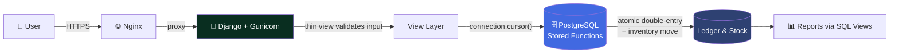
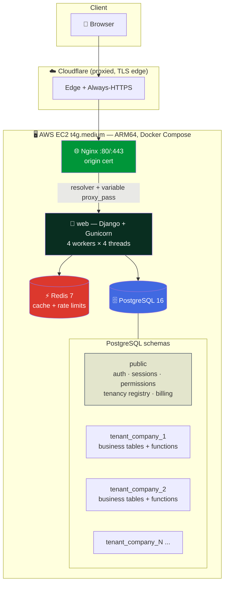
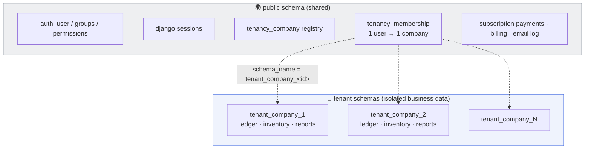
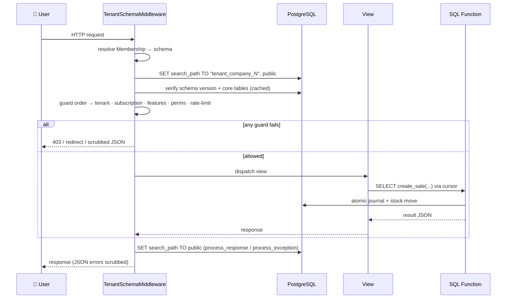
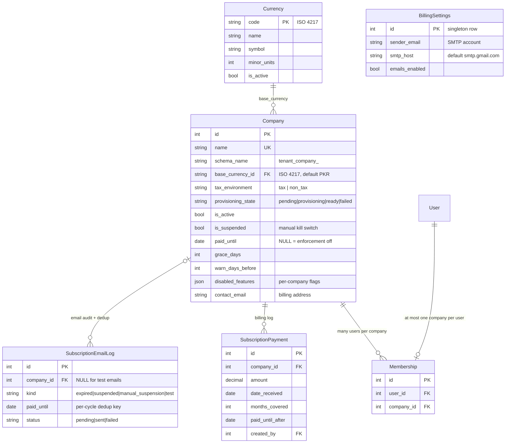
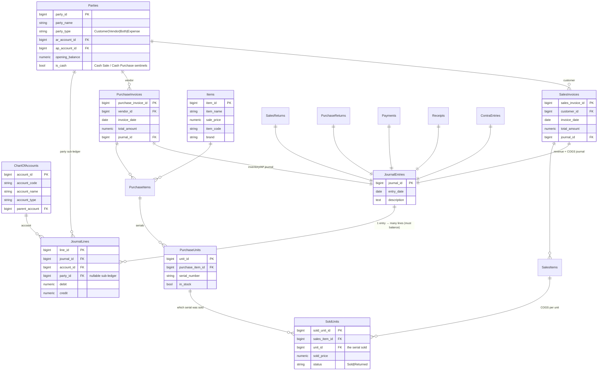
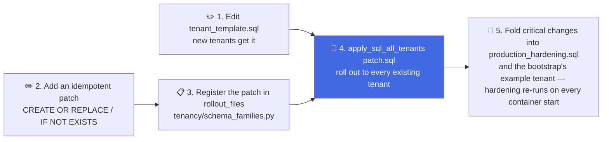
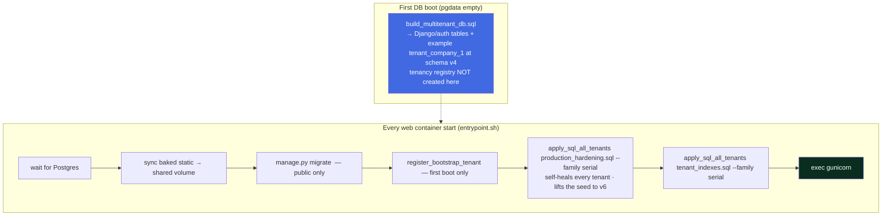
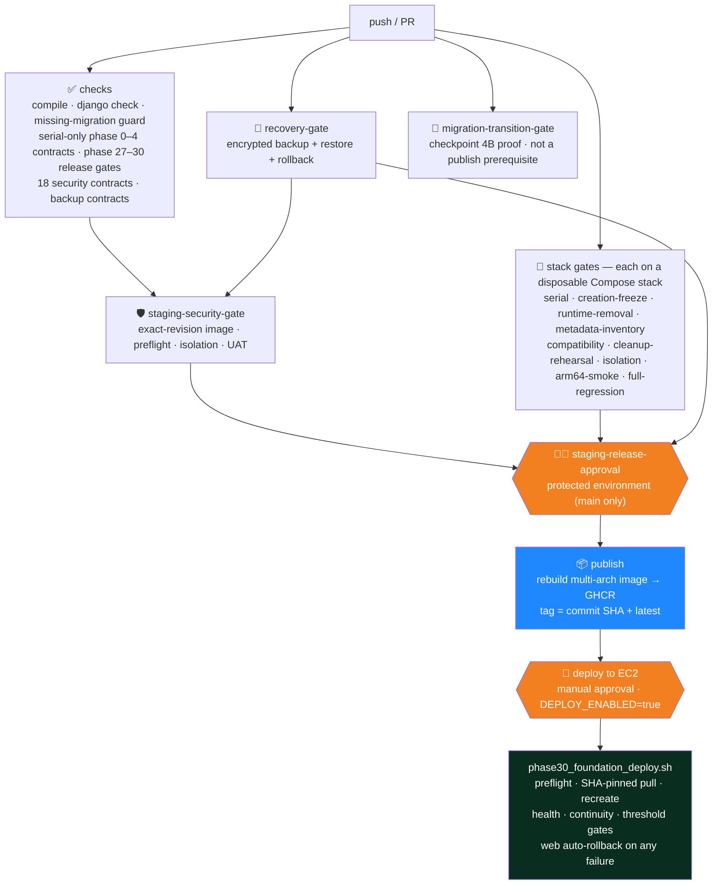

<div align="center">

# 💠 Financee

### Multi-Tenant Accounting & Inventory Platform for Small and Medium Businesses

*One installation. Many isolated companies. Bulletproof double-entry accounting — powered entirely by PostgreSQL.*

<br/>


-0091BD?style=for-the-badge&logo=arm&logoColor=white)


</div>

---

## 📑 Table of Contents

1. [What is Financee?](#-what-is-financee)
2. [Why we built it](#-why-we-built-it)
3. [How it helps businesses](#-how-it-helps-businesses)
4. [How it works — the core idea](#-how-it-works--the-core-idea)
5. [Tech stack](#-tech-stack)
6. [System architecture](#-system-architecture)
7. [Multi-tenancy model](#-multi-tenancy-model)
8. [Request lifecycle](#-request-lifecycle)
9. [Database design & ER diagrams](#-database-design--er-diagrams)
10. [Backend deep-dive](#-backend-deep-dive)
11. [Frontend](#-frontend)
12. [Serial-only runtime](#-serial-only-runtime)
13. [Deployment](#-deployment)
14. [CI/CD pipeline](#-cicd-pipeline)
15. [Backups & disaster recovery](#-backups--disaster-recovery)
16. [Testing](#-testing)
17. [Local development](#-local-development)
18. [Project layout](#-project-layout)
19. [Documentation map](#-documentation-map)

---

## 🎯 What is Financee?

**Financee** is a production accounting and inventory system that serves **many separate companies from a single deployment**. Every company gets its own fully isolated database schema, its own users, its own ledgers, inventory, and reports — while the operator runs and bills them all from one admin panel.

It is built for the way real small businesses actually work: **buy stock → sell it → handle returns → collect and pay money → close the month → read the reports** — with correct double-entry bookkeeping enforced at every single step, not as an afterthought.

> **The defining architectural choice:** Django handles *only* HTTP. **All business logic — accounting, serial inventory, returns, ledgers, and reports — lives inside PostgreSQL** as stored functions, triggers, and views. Each document's journal and any stock movement are written by a single stored-function call, which keeps the financial core atomic, auditable, and out of application code.

---

## 💡 Why we built it

Most off-the-shelf accounting tools force a business into one of two bad corners:

| Problem with typical tools | How Financee answers it |
| --- | --- |
| 🧩 **SaaS lock-in & per-seat pricing** that punishes growth | Self-hosted, **per-company flat billing**, operator-controlled |
| 🔓 **Shared databases** where a query bug can leak Company A's data into Company B | **Hard schema isolation** — each company is a separate PostgreSQL schema |
| 🐛 **Business logic scattered in application code** where a developer can post an unbalanced journal | Accounting lives in the **database**: journals are built only by stored functions and triggers that write matched debit/credit pairs |
| 📦 **Inventory & accounting bolted together loosely**, drifting out of sync | Every stock movement and every rupee move through the **same atomic SQL transaction** |
| 🔎 **Weak unit traceability** for serialized goods such as phones and IMEIs | Every physical unit is tracked through its complete serial lifecycle |

Financee exists to give a small operator a **trustworthy, isolated, low-cost** accounting backbone they can host once and resell to many clients with confidence.

---

## 🏢 How it helps businesses

For the **business owner** using Financee:

- 🧾 **Correct books, automatically.** Every purchase, sale, return, payment, receipt, and contra entry posts a **balanced double-entry journal**, built inside the database by the same call that records the document. Balance holds by construction — every posting function writes matched debit/credit pairs — and the test suite asserts it on every tenant; there is no separate database constraint on journal totals.
- 📦 **Inventory that matches the money.** Stock and cost of goods sold are updated in the *same* transaction as the sale, so inventory value on the balance sheet is always real.
- 🔁 **Returns done right.** Sale/purchase returns restore the exact original cost basis; serials can't be double-returned; a sold serial can't be un-purchased.
- 📊 **Reports that mean something.** Ledgers, trial balance, receivables/payables, cash ledger, stock & serial reports, monthly reports, and sales analytics — all computed from the same authoritative ledger.
- 📎 **Document trail.** Attach the scanned invoice (image + PDF) to any sale, purchase, return, payment, receipt, or contra.

For the **operator** running the platform:

- 🏬 **Onboard a client in seconds** — creating a company automatically provisions its isolated schema.
- 💳 **Manual subscription billing** with a paid-until / grace / auto-suspend state machine, renewal-warning banners, and automated expiry emails — **no payment gateway required**.
- 🎛️ **Per-company feature flags** — switch report groups, CSV export, or attachments on/off per client, straight from the admin.
- 🔐 **Fine-grained permissions** per user, enforced both at the route and in the view.

---

## ⚙️ How it works — the core idea


```mermaid
flowchart LR
    U[👤 User] -->|HTTPS| N[🌐 Nginx]
    N -->|proxy| G[🐍 Django + Gunicorn]
    G -->|"thin view validates input"| V[View Layer]
    V -->|"connection.cursor()"| SQL[(🗄️ PostgreSQL<br/>Stored Functions)]
    SQL -->|"atomic double-entry<br/>+ inventory move"| L[(Ledger & Stock)]
    L --> R[📊 Reports via SQL Views]

    style SQL fill:#4169E1,color:#fff
    style L fill:#2E4172,color:#fff
    style G fill:#092E20,color:#fff
```

1. A request arrives → **Nginx** → **Gunicorn/Django**.
2. Middleware activates the user's company by running `SET search_path TO "tenant_company_<id>", public`.
3. The **thin Django view** validates the input and calls a **PostgreSQL stored function** (e.g. `create_sale(...)`).
4. Inside a single SQL transaction, that function posts the balanced journal **and** moves the inventory **and** returns the result — all-or-nothing.
5. Reports are just **SQL views/functions** reading the same ledger.

**Django never contains business logic.** Views are wrappers. This is the rule the whole codebase obeys.

---

## 🧰 Tech Stack

<div align="center">

| Layer | Technology | Role |
|---|---|---|
| 🐍 **Web framework** |  | HTTP, routing, auth, permissions, admin, templates |
| 🗄️ **Database** |  | **All** business logic: functions, triggers, views, schema-per-tenant |
| ⚡ **Cache / rate limits** |  | Shared cache & cross-worker rate limiting |
| 🦄 **App server** |  | WSGI, threaded `gthread` workers (4 × 4) |
| 🌐 **Reverse proxy** |  | TLS, static/media serving, upstream proxy |
| 🎨 **Frontend** |     | Django templates + JavaScript/jQuery (no SPA framework); Bootstrap CSS, Chart.js, SweetAlert2 from CDNs |
| 📄 **PDF / export** |   | Report PDFs (jsPDF) and CSV exports are built in the browser; ReportLab renders the admin activity PDF |
| 🐳 **Containers** |  | 4-service production stack |
| 🔁 **CI/CD** |  | Test gates → staging approval → publish → approved deploy |
| 📦 **Registry** |  | Multi-arch image `financee-web` |
| ☁️ **Hosting** |   | 2 vCPU / 4 GiB ARM instance |
| 🔒 **TLS / CDN** |  | Full-strict TLS, 15-yr origin cert |

</div>

**Dependencies** are pinned in `requirements.txt` / `requirements-lock.txt` (the source of truth; the `settings.py` header comment still says Django 5.2 but the pin is **6.0.6**).

---

## 🏗️ System Architecture


```mermaid
flowchart TB
    subgraph Client
        B[👤 Browser]
    end

    subgraph Cloudflare["☁️ Cloudflare (proxied, TLS edge)"]
        CF[Edge + Always-HTTPS]
    end

    subgraph EC2["🖥️ AWS EC2 t4g.medium — ARM64, Docker Compose"]
        direction TB
        NG[🌐 Nginx :80/:443<br/>origin cert]
        WEB[🐍 web — Django + Gunicorn<br/>4 workers × 4 threads]
        RD[(⚡ Redis 7<br/>cache + rate limits)]
        PG[(🗄️ PostgreSQL 16)]

        NG -->|resolver + variable proxy_pass| WEB
        WEB --> RD
        WEB --> PG

        subgraph PG_SCHEMAS["PostgreSQL schemas"]
            direction LR
            PUB[public<br/>auth · sessions · permissions<br/>tenancy registry · billing]
            T1[tenant_company_1<br/>business tables + functions]
            T2[tenant_company_2<br/>business tables + functions]
            TN[tenant_company_N ...]
        end
        PG --- PG_SCHEMAS
    end

    B --> CF --> NG

    style PG fill:#4169E1,color:#fff
    style WEB fill:#092E20,color:#fff
    style RD fill:#DC382D,color:#fff
    style NG fill:#009639,color:#fff
    style PUB fill:#33415522,stroke:#334155
```

**Four Docker services**, co-located on one ARM EC2 box:

| Service | Image | Notes |
|---|---|---|
| `db` | `postgres:16` | Tuned via command flags for 2 vCPU / 4 GiB. First boot seeds `build_multitenant_db.sql`. |
| `web` | `ghcr.io/.../financee-web` | Django + Gunicorn. Static baked at build with content-hashed manifest. |
| `nginx` | `nginx:1.27` | Reverse proxy; Docker-DNS resolver + variable `proxy_pass` so recreating `web` needs no restart. |
| `redis` | `redis:7-alpine` | Shared cache & rate-limit store (`appendonly`). |

---

## 🧩 Multi-tenancy model

Financee's isolation is **schema-per-tenant**, not row-level. This is the most important thing to understand.


```mermaid
flowchart TB
    subgraph public["🌍 public schema (shared)"]
        AU[auth_user / groups / permissions]
        SE[django sessions]
        CO[tenancy_company registry]
        ME[tenancy_membership<br/>1 user → 1 company]
        SUB[subscription payments · billing · email log]
    end

    subgraph tenants["🏢 tenant schemas (isolated business data)"]
        direction LR
        TC1[tenant_company_1<br/>ledger · inventory · reports]
        TC2[tenant_company_2<br/>ledger · inventory · reports]
        TCN[tenant_company_N]
    end

    ME -.->|"schema_name = tenant_company_&lt;id&gt;"| TC1
    ME -.-> TC2
    ME -.-> TCN

    style public fill:#33415515,stroke:#334155
    style tenants fill:#4169E115,stroke:#4169E1
```

- **Two ORM models** carry tenancy: `Company` and `Membership`. The only other models are `Currency` and the billing trio (`SubscriptionPayment`, `BillingSettings`, `SubscriptionEmailLog`), all in `public`. **Business tables are never Django models.**
- A user belongs to **exactly one** company (`Membership.user` is a `OneToOneField`); a company has many members.
- Creating a `Company` fires a `post_save` signal → `tenancy/provisioning.py` materializes the schema from `tenancy/sql/tenant_template.sql` in one transaction (idempotent). The outcome is recorded in `provisioning_state`; a failed build leaves the company `failed` and inactive until `retry_tenant_provisioning` succeeds.
- Schema names are **validated by regex and double-quoted** — never bound parameters (identifiers can't be parameterized). Helpers live in `tenancy/utils.py`.
- Every tenant schema carries a single-row `tenant_schema_version`. Before any view runs, the middleware checks that the row exists, is **at least** `TENANT_SCHEMA_VERSION` (currently **6**), and that the core tables are present; otherwise the user gets a 403.

---

## 🔄 Request lifecycle

`TenantSchemaMiddleware` (`tenancy/middleware.py`) is the heart of the isolation guarantee.


```mermaid
sequenceDiagram
    participant U as 👤 User
    participant MW as TenantSchemaMiddleware
    participant DB as PostgreSQL
    participant V as View
    participant FN as SQL Function

    U->>MW: HTTP request
    MW->>MW: resolve Membership → schema
    MW->>DB: SET search_path TO "tenant_company_N", public
    MW->>DB: verify schema version + core tables (cached)
    MW->>MW: guard order → tenant · subscription · features · perms · rate-limit
    alt any guard fails
        MW-->>U: 403 / redirect / scrubbed JSON
    else allowed
        MW->>V: dispatch view
        V->>FN: SELECT create_sale(...) via cursor
        FN->>DB: atomic journal + stock move
        FN-->>V: result JSON
        V-->>MW: response
    end
    MW->>DB: SET search_path TO public (process_response / process_exception)
    MW-->>U: response (JSON errors scrubbed)
```

**Guard order in `process_view`:** tenant validity → subscription state → per-company feature flag → route permission → rate limit. `process_response` and `process_exception` reset `search_path` to `public`, and each request sets its own path in `process_request`, so a persistent (`CONN_MAX_AGE`) connection never carries one request's tenant into the next. Gunicorn runs threaded `gthread` workers whose Django connections are thread-local; **never switch to gevent/eventlet**, which would let two requests interleave on one connection.

---

## 🗃️ Database design & ER diagrams

### Public (shared) schema


```mermaid
erDiagram
    Currency ||--o{ Company : "base_currency"
    Company ||--o{ Membership : "many users per company"
    User ||--o| Membership : "at most one company per user"
    Company ||--o{ SubscriptionPayment : "billing log"
    Company |o--o{ SubscriptionEmailLog : "email audit + dedup"

    Company {
        int id PK
        string name UK
        string schema_name "tenant_company_<id>"
        string base_currency_id FK "ISO 4217, default PKR"
        string tax_environment "tax | non_tax"
        string provisioning_state "pending|provisioning|ready|failed"
        bool is_active
        bool is_suspended "manual kill switch"
        date paid_until "NULL = enforcement off"
        int grace_days
        int warn_days_before
        json disabled_features "per-company flags"
        string contact_email "billing address"
    }
    Membership {
        int id PK
        int user_id FK
        int company_id FK
    }
    Currency {
        string code PK "ISO 4217"
        string name
        string symbol
        int minor_units
        bool is_active
    }
    SubscriptionPayment {
        int id PK
        int company_id FK
        decimal amount
        date date_received
        int months_covered
        date paid_until_after
        int created_by FK
    }
    SubscriptionEmailLog {
        int id PK
        int company_id FK "NULL for test emails"
        string kind "expired|suspended|manual_suspension|test"
        date paid_until "per-cycle dedup key"
        string status "pending|sent|failed"
    }
    BillingSettings {
        int id PK "singleton row"
        string sender_email "SMTP account"
        string smtp_host "default smtp.gmail.com"
        bool emails_enabled
    }
```

### Tenant business schema (per company — serial family)


```mermaid
erDiagram
    ChartOfAccounts ||--o{ JournalLines : "account"
    JournalEntries ||--o{ JournalLines : "1 entry → many lines (must balance)"
    Parties ||--o{ JournalLines : "party sub-ledger"
    Parties ||--o{ PurchaseInvoices : "vendor"
    Parties ||--o{ SalesInvoices : "customer"

    PurchaseInvoices ||--o{ PurchaseItems : ""
    PurchaseItems ||--o{ PurchaseUnits : "serials"
    Items ||--o{ PurchaseItems : ""

    SalesInvoices ||--o{ SalesItems : ""
    SalesItems ||--o{ SoldUnits : "COGS per unit"
    PurchaseUnits ||--o{ SoldUnits : "which serial was sold"

    SalesInvoices ||--|| JournalEntries : "revenue + COGS journal"
    PurchaseInvoices ||--|| JournalEntries : "inventory/AP journal"
    SalesReturns ||--|| JournalEntries : ""
    PurchaseReturns ||--|| JournalEntries : ""
    Payments ||--|| JournalEntries : ""
    Receipts ||--|| JournalEntries : ""
    ContraEntries ||--|| JournalEntries : ""

    JournalEntries {
        bigint journal_id PK
        date entry_date
        text description
    }
    JournalLines {
        bigint line_id PK
        bigint journal_id FK
        bigint account_id FK
        bigint party_id FK "nullable sub-ledger"
        numeric debit
        numeric credit
    }
    ChartOfAccounts {
        bigint account_id PK
        string account_code
        string account_name
        string account_type
        bigint parent_account FK
    }
    Parties {
        bigint party_id PK
        string party_name
        string party_type "Customer|Vendor|Both|Expense"
        bigint ar_account_id FK
        bigint ap_account_id FK
        numeric opening_balance
        bool is_cash "Cash Sale / Cash Purchase sentinels"
    }
    Items {
        bigint item_id PK
        string item_name
        numeric sale_price
        string item_code
        string brand
    }
    PurchaseInvoices {
        bigint purchase_invoice_id PK
        bigint vendor_id FK
        date invoice_date
        numeric total_amount
        bigint journal_id FK
    }
    PurchaseUnits {
        bigint unit_id PK
        bigint purchase_item_id FK
        string serial_number
        bool in_stock
    }
    SalesInvoices {
        bigint sales_invoice_id PK
        bigint customer_id FK
        date invoice_date
        numeric total_amount
        bigint journal_id FK
    }
    SoldUnits {
        bigint sold_unit_id PK
        bigint sales_item_id FK
        bigint unit_id FK "the serial sold"
        numeric sold_price
        string status "Sold|Returned"
    }
```

> The serial runtime tracks every physical unit by serial number (`PurchaseUnits` → `SoldUnits`), so cost of goods sold and returns are exact per-unit.

Entity names are CamelCased for readability; the real tables are lowercase (`journalentries`, `purchaseunits`, `contra_entries`, …). Each document points at its journal through a nullable `journal_id` column: invoices and returns rebuild their journal inside the posting function, while payments, receipts and contra entries are journaled by `AFTER` triggers. Journals balance by construction — every builder writes matched debit/credit pairs — while `journallines` itself only enforces per-row rules (amounts non-negative, not both zero). Also in each tenant schema: `salesreturnitems` / `purchasereturnitems`, `stockmovements`, `opening_cash`, `owner_equity_transactions`, `period_closes`, `document_attachments`, and the single-row `tenant_schema_version`.

### Key SQL entry points (functions, not views)

`create_purchase` · `create_sale` · `create_sale_return` · `create_purchase_return` · `make_payment` · `make_receipt` · `make_contra` · `create_opening_stock` · `set_opening_cash_from_json` · `add_owner_equity_txn` · `preview_period_close` / `close_period_from_json` / `reverse_period_close` · `sales_summary_json` · `product_profitability_json` · `invoice_register_json` … (full list in `PROJECT_CONTEXT.md`).

---

## 🧠 Backend deep-dive

### Django apps

| App | Responsibility |
|---|---|
| `tenancy` | Company registry, membership, schema switching, serial provisioning and SQL rollout, subscriptions, feature flags |
| `authentication` | Login/logout, current-user JSON, login rate limit, permission seeding |
| `home` | Dashboard page, dashboard JSON APIs, shared lookup APIs (cash, parties, items, balances) |
| `parties` · `items` | Master data + autocomplete |
| `purchase` · `sale` | Invoice create/update/delete, navigation, summaries, serial checks |
| `purchaseReturn` · `saleReturn` | Returns with lifecycle guards |
| `payments` · `receipts` · `contra` | Cash movement + party balances |
| `opening_stock` · `set_opening` · `owner_equity` · `month_close` | Onboarding & period close |
| `accountsReports` · `sales_reports` | Ledgers, trial balance, stock/serial, monthly reports, sales analytics |
| `attachments` | Authenticated image/PDF metadata, preview and download; upload/cleanup helpers used by the seven document views |

### Changing tenant SQL (critical workflow)

Any change to tenant business SQL needs **coordinated edits**, or new and existing tenants diverge:


```mermaid
flowchart LR
    A["✏️ 1. Edit tenant_template.sql<br/>new tenants get it"] --> C
    B["✏️ 2. Add an idempotent patch<br/>CREATE OR REPLACE / IF NOT EXISTS"] --> R
    R["📋 3. Register the patch in rollout_files<br/>tenancy/schema_families.py"] --> C
    C["🚀 4. apply_sql_all_tenants patch.sql<br/>roll out to every existing tenant"]
    C --> D["🔁 5. Fold critical changes into production_hardening.sql<br/>and the bootstrap's example tenant — hardening re-runs on every container start"]
    style C fill:#4169E1,color:#fff
```

- `apply_sql_all_tenants` **refuses any file not listed in `rollout_files`** — only 8 of the 17 files in `tenancy/sql/` are registered.
- **Leave the tenant schema version at 6** unless code depends on the change: the Phase 3B restore guard requires exactly v6, so a bump blocks that reversal path (see `FIXED_ISSUES.md`).
- CI pins **byte-identity hashes** of every tenant SQL file and of the bootstrap's example-tenant section (`tests/phase2_serial_runtime_removal_contracts.py`); a deliberate change must re-pin them in the same commit.

`python manage.py migrate` **only ever touches `public`** — never tenant business schemas.

### Security & guards (`financee/security.py`)

- **`PROTECTED_PREFIX_PERMS`** maps URL prefixes → required `auth.*` permissions (mode `all`); `/sales-reports/` uses `SALES_REPORT_PERMS` (mode `any`). Views **also** re-check permissions individually.
- **Rate limits** (cache-backed, per-tenant keys): dashboard 180/min, reports 90/min, lookup 240/min, login 10/min. Set `REDIS_URL` in production so limits apply across workers.
- **JSON error scrubbing**: middleware strips internal detail from 4xx/5xx JSON responses.

### Commercial layer (all in `public`, zero tenant SQL)

- **Subscription control** — `paid_until` + `grace_days` + `is_suspended` → `unrestricted / active / expiring / grace / blocked / suspended` state machine. Blocked users hit a branded pay-wall; superusers are never blocked. `SubscriptionPayment` is an immutable audit log that extends access and lifts suspension.
- **Subscription emails** — automatic expiry/suspension notices to `contact_email`, per-cycle dedup, hourly WSGI-driven scan, Gmail SMTP configured entirely from the admin.
- **Per-company feature flags** — `disabled_features` switches off any of 8 groups: the four report groups (with their 27 sub-reports), opening stock, opening cash, CSV export and attachments. Middleware enforces them by URL prefix and the UI hides them; the CSV switch (`excel_export`) only hides buttons, because export happens in the browser.

---

## 🎨 Frontend

- **Django templates + JavaScript with jQuery** — no SPA framework. Third-party libraries (jQuery, Bootstrap CSS, Font Awesome, Chart.js, jsPDF, SweetAlert2) load from CDNs. Pages render the business document first, then load attachment metadata / heavy data asynchronously.
- **Exports run in the browser** — report PDFs use jsPDF and CSV files are assembled client-side. The only server-side PDF is the admin activity report (ReportLab).
- **Static files are content-hashed** at Docker build time (`ManifestStaticFilesStorage`), so a changed CSS/JS file gets a new name automatically — no cache-busting, ever.
- **Unified alert layer** — every user-facing alert goes through the `Alerts` helper (`static/js/alerts.js`, a SweetAlert2 wrapper). Never call `Swal.fire` directly. Only consequential actions get a confirm dialog (deletes, month close and its reversal, opening-balance reclassify, selling below cost, replacing an attachment); other feedback is a non-blocking toast, with `Alerts.loading` / `Alerts.dialog` for spinners and input forms.
- **Custom admin site** (`financee/admin_site.py`) — muted professional theme, KPI cards, subscription badges, user-activity pages with PDF export. Activity is aggregated across tenant schemas only when `TENANCY_CROSS_TENANT_ACTIVITY=True` (off by default).
- Dark mode is **temporarily retired** (commented out, not deleted) pending a rework.

---

## 🔀 Serial-only runtime

Financee serves and provisions the **serial schema family only**. Every item is
tracked per physical serial number through purchase, sale, return, stock, and
reporting workflows. There is no inventory-mode concept left to configure: the
model, admin, provisioning commands and schema-family registry can only express
a serial company, and the retired `inventory_mode` column, its check
constraint, and the retired permissions have been removed from the production
database under the Phase 3B guarded, reversible cleanup.

The former quantity HTTP routes, dispatchers, templates, static assets,
dashboard branches, startup SQL maintenance, schema descriptors, SQL templates
and test modules have all been retired, and the consolidation is **complete**
(phases 0–4). Checkpoint 4B deleted the replaced Django migration files, so
`tenancy` and `authentication` each have a single ordinary initial migration
(`0001_serial_only.py`). The follow-up prune of the old `django_migrations`
rows was built and proven reversible but deliberately **not** run — a rollback
attempted after a prune corrupts the migration history — so production keeps
those inert rows. "Serial only" is proven physically by schema verification
rather than by any registry metadata value. The Phase 3B archive and its
restore tooling are the reversal path — keep them. See
`SERIAL_ONLY_REMOVAL_PLAN.md` and `PHASE3B_MAINTENANCE_RUNBOOK.md`.

---

## 🚀 Deployment

### Docker stack (`deploy/`)


```mermaid
flowchart TB
    subgraph boot["First DB boot (pgdata empty)"]
        SEED[build_multitenant_db.sql<br/>→ Django/auth tables + example tenant_company_1 at schema v4<br/>tenancy registry NOT created here]
    end
    subgraph start["Every web container start (entrypoint.sh)"]
        W1[wait for Postgres] --> W2[sync baked static → shared volume]
        W2 --> W3[manage.py migrate  — public only]
        W3 --> RB[register_bootstrap_tenant — first boot only]
        RB --> W4[apply_sql_all_tenants production_hardening.sql --family serial<br/>self-heals every tenant · lifts the seed to v6]
        W4 --> W5[apply_sql_all_tenants tenant_indexes.sql --family serial]
        W5 --> W6[exec gunicorn]
    end
    SEED -.-> start
    style SEED fill:#4169E1,color:#fff
    style W6 fill:#092E20,color:#fff
```

- **Host:** AWS **EC2 `t4g.medium`** — ARM64 Graviton, 2 vCPU / 4 GiB. Postgres, Redis, web, and nginx all co-located; DB tuned accordingly (`shared_buffers=768MB`, `work_mem=4MB`, etc.).
- **TLS:** domain `financee-swisstech.com` on **Cloudflare (proxied)**, Full-strict mode, **Cloudflare Origin Certificate** on nginx (15-yr, no certbot/renewal). The 443 listener lives in `docker-compose.tls.yml`, auto-added by the deploy scripts once `origin.pem` exists on the host — so HTTP-only deploys never break before the cert is installed.
- **Static:** collected at image build; entrypoint syncs the baked tree into the shared volume so nginx serves current hashed assets after every deploy. The one-shot allowlist that removed retired quantity assets completed its rollout and was itself retired in checkpoint 4A. The previous image repopulates its own assets on rollback.
- **Ports:** only 22 / 80 / 443 open; Postgres & Redis stay internal to the Docker network.

Full step-by-step (fresh EC2 → running stack → CI/CD → HTTPS → daily backup) is in **`DEPLOYMENT_GUIDE.md`**.

---

## 🔁 CI/CD pipeline

`.github/workflows/ci.yml` runs on **every push & PR**:


```mermaid
flowchart TB
    P[push / PR] --> CH[✅ checks<br/>compile · django check · missing-migration guard<br/>serial-only phase 0–4 contracts · phase 27–30 release gates<br/>18 security contracts · backup contracts]
    P --> SG[🧪 stack gates — each on a disposable Compose stack<br/>serial · creation-freeze · runtime-removal · metadata-inventory<br/>compatibility · cleanup-rehearsal · isolation · arm64-smoke · full-regression]
    P --> RG[🔐 recovery-gate<br/>encrypted backup + restore + rollback]
    P --> MT[🧪 migration-transition-gate<br/>checkpoint 4B proof · not a publish prerequisite]

    CH & RG --> SS[🛡️ staging-security-gate<br/>exact-revision image · preflight · isolation · UAT]
    SS & SG & RG --> AP{{"🧑‍⚖️ staging-release-approval<br/>protected environment (main only)"}}
    AP --> PUB[📦 publish<br/>rebuild multi-arch image → GHCR<br/>tag = commit SHA + latest]
    PUB --> DEP{{"🚀 deploy to EC2<br/>manual approval · DEPLOY_ENABLED=true"}}
    DEP --> SH[phase30_foundation_deploy.sh<br/>preflight · SHA-pinned pull · recreate<br/>health · continuity · threshold gates<br/>web auto-rollback on any failure]

    style AP fill:#F38020,color:#fff
    style DEP fill:#F38020,color:#fff
    style PUB fill:#2088FF,color:#fff
    style SH fill:#092E20,color:#fff
```

1. **checks** — compile, `manage.py check`, `makemigrations --check` (fails if a model change lacks its migration), the database-free serial-only contracts for phases 0–4, the Phase 27–30 release gates (including the 18 Phase 29 security contracts), backup contracts, and `pip check`.
2. **Stack gates** — each boots its own disposable Compose stack
   (`tests/ci_phase27_stack.sh`): serial regression, serial-only creation
   freeze, retired-runtime negative routes, Phase 3 metadata inventory,
   Phase 3A compatibility, four-serial-company isolation, **ARM64 execution
   smoke** and the full `tests/suite` regression. `cleanup-rehearsal-gate`
   replays the Phase 3B reversible cleanup, and `recovery-gate` rehearses
   encrypted backup/restore/rollback.
3. **staging-security-gate** (after `checks` + `recovery-gate`) — builds the source image once and asserts its OCI revision label, then runs preflight, the foundation audit around the hardening SQL, the hardening and serial-only tests, four-company isolation and the capacity preflight on a production-like stack.
4. **staging-release-approval** — a **protected GitHub environment** (product/eng/ops sign-off) on `main` pushes only. It needs every gate above except `migration-transition-gate`, which runs on every push but is not in any job's `needs`, so it does not block a release.
5. **publish** — rebuilds the approved commit as a multi-arch image (`linux/amd64` + `linux/arm64`) and pushes it to **GHCR** tagged with the commit SHA + `latest`.
6. **deploy** — gated by `DEPLOY_ENABLED=true` **and** manual approval of the `production` environment → SSH to EC2 → `git pull --ff-only` → `deploy/phase30_foundation_deploy.sh` (see `PHASE30_PRODUCTION_FOUNDATION_RUNBOOK.md`): preflight, candidate-image audit, optional encrypted backup (`PHASE30_BACKUP_MODE`, default `external`), **SHA-pinned image pull (no build on server)**, recreate web (+ nginx when its config changed), health check through nginx, then continuity-fingerprint and stability/threshold gates. **Any failure rolls web back to the previous image.**

> ⚠️ **Rollback caveat:** a rollback restores the web image only. It does **not** revert public migrations, tenant SQL (the new container's entrypoint has already applied `production_hardening.sql` before the health check), nginx, or the host checkout. Keep migrations and tenant SQL **backward-compatible** — the same idempotent-patch discipline used everywhere.

---

## 💾 Backups & disaster recovery

Two independent, rehearsed layers:

| Layer | What | Where | Cadence |
|---|---|---|---|
| **Phase 28 bundle** | Encrypted PostgreSQL **+ media** as one checksummed bundle | Off-instance destination (per runbook), passphrase stored separately | On demand; before a deploy when `PHASE30_BACKUP_MODE=encrypted` (default `external`) |
| **Daily DB backup** | Encrypted PostgreSQL-only custom-format dump (public + all tenants) | Private GitHub Releases repo `financee_pk_backup` | systemd timer, **daily 02:15 UTC** |

- Every backup is **encrypted (AES-256-CBC, PBKDF2) + double-checksummed** (ciphertext SHA-256 sidecar + internal manifest). The uploader independently re-downloads, verifies, decrypts, and reads the `pg_restore` catalogue before recording success.
- **Rehearse a restore before relying on the timer** — an isolated, non-production Compose project (forbidden production-name guard), verified to health + all-tenant `release_preflight`.
- Retention: newest **30 daily** + first success in each of the newest **12 months**. `deploy/database_backup_status.sh` reports `STALE` (exit 1) when the newest backup is over 26 h old — it is **not scheduled**, so run it by hand or wire it into monitoring.

Runbooks: **`DATABASE_BACKUP_GITHUB_RUNBOOK.md`**, **`PHASE28_RECOVERY_RUNBOOK.md`**.

---

## 🧪 Testing

The harnesses run **inside the running `web` container** (not the host venv). The SQL-level harnesses iterate **every active tenant** and assert **real accounting invariants** — not just "did not error".

```bash
./tests/run_tests.sh            # copies tests/ into the container, runs test_system.py + test_http.py
./tests/run_tests.sh --reset    # ALSO drops + re-provisions tenant schemas for a clean signal

# after run_tests.sh has copied tests/ in once:
docker compose -f deploy/docker-compose.yml exec web python tests/suite/run_all.py
docker compose -f deploy/docker-compose.yml exec web python tests/test_transaction_lifecycle_deep.py
```

| Harness | Coverage |
|---|---|
| `tests/suite/run_all.py` | **Comprehensive** — 21 modules: every domain & every report on all active tenants, plus subscriptions, feature flags, attachments, company setup and the serial-only phase gates; double-entry balance, party balances, COGS, stock/serial coherence; `XFAIL` channel. This is what CI's `full-regression` gate runs |
| `test_system.py` | SQL business functions per tenant. It prints a `TOTAL FAILURES` summary but **always exits 0** — read the output |
| `test_http.py` | Django test client over real views and templates, as a superuser attached to the first active company |
| `test_transaction_lifecycle_deep.py` | Serial lifecycle stress (purchase→sale→return→resale, mixed invoices, return guards); **intentionally fails** on duplicate returns / invalid serial transitions. Run it by hand — it is not part of `run_tests.sh` or CI |
| `phase25_four_company_isolation.py` · `phase26_capacity_preflight.py` | Four-company leakage/concurrency gate · t4g.medium configuration preflight (the 100-session benchmark itself was retired with the quantity family) |
| `tests/phase*_contracts.py` & release gates | Database-free contracts that CI's `checks` job runs on the runner, not in the container |

Latest recorded full run (2026-09-16, the dashboard-receivables release): **all 21 suite modules passed**, `test_system.py` reported 0 failures and the lifecycle harness fully passed — see `FIXED_ISSUES.md`. (`tests/suite/RESULTS.md` holds the older 2026-07-06 per-module matrix.)

> **CI pins parts of the repo byte-for-byte.** `tests/phase2_serial_runtime_removal_contracts.py` hashes 212 files under `static/` and `templates/` (everything except `templates/base/base.html`), all 17 tenant SQL files, the bootstrap's example-tenant section and 12 serial document views; a deliberate change there must re-pin the hash in the same commit. `tests/phase4_repository_hygiene_contracts.py` also requires specific sentences to stay in `README.md`, `CLAUDE.md` and `PROJECT_CONTEXT.md`.

---

## 💻 Local development

```bash
# 1. Dependencies
python -m venv venv && source venv/bin/activate
pip install -r requirements-lock.txt

# 2. Environment — create .env at project root
#    SECRET_KEY, DEBUG=True, ALLOWED_HOSTS, DB_NAME/USER/PASSWORD/HOST/PORT
#    (keep DEBUG=True locally: with DEBUG=False the hashed-manifest static
#     storage needs collectstatic and runserver stops serving static files)

# 3. Public/shared migrations (never touches tenant business schemas)
python manage.py migrate            # also seeds the ISO 4217 currency catalogue
python manage.py createsuperuser

# 4. Provision a tenant and attach an EXISTING user (e.g. the superuser above)
python manage.py provision_tenant "Demo Co" --owner alice
#    defaults: --base-currency PKR --tax-environment non_tax

# 5. Run
python manage.py runserver
```

### Tenant operations

```bash
# Roll a registered tenant SQL patch out to every tenant
# (--dry-run / --only / --include-public / --family). Only files listed in
# rollout_files (tenancy/schema_families.py) are accepted.
python manage.py apply_sql_all_tenants tenancy/sql/<patch>.sql
python manage.py apply_sql_all_tenants tenancy/sql/<patch>.sql --only tenant_company_3

# Verify every active tenant (version, fingerprint, safe probe) before/after a release
python manage.py release_preflight

# Retry a failed/pending schema build
python manage.py retry_tenant_provisioning <COMPANY_ID>

# Re-sync the ISO 4217 currency catalogue (idempotent)
python manage.py seed_currencies
```

### Docker (production-like)

```bash
cd deploy
cp .env.example .env      # then edit
docker compose -f docker-compose.yml up -d --build
docker compose -f docker-compose.yml exec web python manage.py createsuperuser
```

The first boot seeds the example tenant and registers it as **Company One**; attach your user to it from that company's page in `/admin/`. Plain `docker compose up -d --build` (without `-f`) also merges `docker-compose.override.yml` — a smaller Postgres with port 5432 exposed, sized for a laptop.

---

## 📁 Project layout

```
Financee_Multitenant_Production/
├── financee/               # settings, urls, security guards, admin site, wsgi/asgi
│   ├── settings.py         #   env-driven config, CONN_MAX_AGE, cache, security flags
│   └── security.py         #   permission prefixes, rate limits, guard responses
├── tenancy/                # the multitenancy engine
│   ├── middleware.py       #   search_path activation + guard chain
│   ├── models.py           #   Company, Membership, Currency, subscriptions, billing
│   ├── provisioning.py     #   post_save → materialize schema
│   ├── utils.py            #   schema helpers (validated + quoted)
│   ├── schema_families.py  #   serial schema definition + rollout-file registry
│   ├── features.py         #   per-company feature flags
│   ├── sql/                #   tenant_template.sql + idempotent patches (17 files)
│   └── management/commands/#   apply_sql_all_tenants, provision_tenant, release_preflight …
├── <feature apps>/         # parties, items, purchase, sale, returns, payments, receipts,
│                           #   contra, opening_stock, owner_equity, month_close, reports …
├── attachments/            # authenticated image/PDF handling
├── templates/  static/     # Django templates, CSS, vanilla JS, alerts layer
├── deploy/                 # Docker stack, entrypoint, nginx, TLS overlay, backup + deploy scripts
├── tests/                  # suite/ + system/http/lifecycle harnesses + phase gates
├── .github/workflows/      # ci.yml + manually dispatched one-shot ops workflows
├── build_multitenant_db.sql# first-boot seed (public + example tenant)
└── *.md                    # the documentation set (below)
```

---

## 📚 Documentation map

| File | Purpose |
|---|---|
| **`README.md`** | This overview |
| **`CLAUDE.md`** | Instructions & guardrails for AI-assisted work in this repo |
| **`PROJECT_CONTEXT.md`** | Persistent engineering context — **keep current** |
| **`FIXED_ISSUES.md`** | Diagnosed production/setup bugs, root causes & fixes |
| **`DEPLOYMENT_GUIDE.md`** | Fresh EC2 → running stack → CI/CD → HTTPS → daily backup, step by step |
| **`PHASE30_PRODUCTION_FOUNDATION_RUNBOOK.md`** | The Phase 30 deploy controller that every production release runs |
| **`PHASE29_STAGING_SECURITY_RUNBOOK.md`** | Staging acceptance & security gate |
| **`DATABASE_BACKUP_GITHUB_RUNBOOK.md`** · **`PHASE28_RECOVERY_RUNBOOK.md`** | Backup & restore runbooks |
| **`SERIAL_ONLY_REMOVAL_PLAN.md`** | Serial-only consolidation plan (complete), phase gates & audit trail |
| **`PHASE3B_MAINTENANCE_RUNBOOK.md`** | Phase 3B cleanup and its reversal — the retained restore path |
| **`todo.md`** | Historical record of the retired quantity-family rollout (33 planned phases, 0–29 recorded complete), plus open daily-backup follow-ups |
| `tests/README.md` · `tests/suite/README.md` | Test harness docs |
| `tests/PHASE*_RESULTS.md` | Historical phase evidence |

---

<div align="center">

### Built for correctness first. 🧮
*Accounting logic lives in the database, isolation is enforced per schema, and nothing ships that hasn't passed the full test pyramid on a from-scratch stack.*

</div>
